# InsideUE文章的记录
https://www.zhihu.com/column/insideue4
## UObject
在UE4中，几乎所有的类都继承自UObject，UObject为他们提供了基础的垃圾回收，反射，元数据，序列化等等。

## Actor
Actor继承自UObject，能在场景中放置的都是Actor，同时它也多了额外的属性，如Replication(网络复制) Spwan(生成) Tick(每帧执行的函数)
一个对象在3D世界中表示，必需要有Transform合Matrix。但是有些对象它是Actor，但是不需要表示其位置，如Ainfo(AWorldSetting AGameMode AGameSession APlayerState AGameState) AHUD APlayerCameraManager等，他们代表了世界的某种信息，状态，规则。但是他们不需要在场景中显示出来。
在UE中，万物皆是Actor。

UE把Transform封装进了SceneComponent，要显示位置的Actor，就有这个RootComponent，即物体加组件的模式。
所以Actor获取位置或者设置位置，都是dispatch到这个RootComponent的。
同理，要获取输入的话，就需要InputComponent。
UE也是参考了Unity的，采用了这种ECS架构，Actor只是个基础，而功能都是由component实现的。

	TSet<UActorComponent*> OwnedComponents，保存着这个Actor所拥有的所有components。一般会有一个SceneComponent作为其RootComponent。
	TArray<UActorComponent*> InstanceComponents 保存着其实例化的components，一个Actor如果想放进Level里，就必须实例化USceneComponent* RootComponent
### ActorComponent
components的类图如下。

可以看到，SceneComponent有Transform，另外的AttachParent和AttachChildren告诉我们，component可以作为另一个component的父类，即components可以嵌套。
一个component可以有多个component子类。但是注意限制，只有SceneComponent才可以互相嵌套。而最上层的ActorComponent是不行的。
可以说，只有位置Transform的component才能互相嵌套。

但是也要注意SceneComponent嵌套过深的问题。
### Actor之间的父子关系
Actor之间的父子关系是通过Component确定的，UE里通过Child:AttachToActor或Child:AttachToComponent来创建父子连接的。

	void AActor::AttachToActor(AActor* ParentActor, const FAttachmentTransformRules& AttachmentRules, FName SocketName)
	{
		if (RootComponent && ParentActor)
		{
			USceneComponent* ParentDefaultAttachComponent = ParentActor->GetDefaultAttachComponent();
			if (ParentDefaultAttachComponent)
			{
				RootComponent->AttachToComponent(ParentDefaultAttachComponent, AttachmentRules, SocketName);
			}
		}
	}
	void AActor::AttachToComponent(USceneComponent* Parent, const FAttachmentTransformRules& AttachmentRules, FName SocketName)
	{
		if (RootComponent && Parent)
		{
			RootComponent->AttachToComponent(Parent, AttachmentRules, SocketName);
		}
	}
可以看到，它实际上是拿自身的RootComponent附加Attach到父节点的RootComponent上或者某个component上的。所以本质上来讲，还是SceneComponent的互相嵌套。
可以绑定到不同的component上，意味着就是有多个不同的锚点。比如mesh上的武器socket槽。那么运动的时候，父节点component的Transform就会影响到子component上。
Actor其实更像一个容器，只提供基本的创建销毁，网络复制，事件触发等一些逻辑性的功能，而父子的关系维护就委托给了具体的SceneComponent。
### ChildActorComponent
ChildActorComponent担负着Actor之间互相组合的胶水。它的ChildActorClass表示它实例化时要创建的Actor。
## Level
一个Level组织所有的Actor，多个Level组成World。

AInfo，记录着本Level的各种规则属性。WorldSettings记录Level的规则。
## World
当一个World有多个level的时候，这些Level在什么位置，是在一开始加载进来的，还是Streaming运行时加载，每个World支持一个PersistentLevel和多个其它level。
Persistent即一开始加载进world，streaming时后续动态加载的意思，levels里保存有所有的当前已经加载的level，streaminglevels保存整个world的levels配置列表。

玩家切换场景，就是在world种加载和释放不同的Level。
## WorldContext
World可以有多个，主要是编辑器一个world，编辑器里的game一个world，worldcontext负责这些world的切换，而同时也保存着Level切换的上下文。TravelUrl和TravelType就是负责设定下一个level的目标和转换过程。
level的上下文由worldcontext来保存，而不是由world。world和level的切换是在下一帧完成的。

## GameInstance
GameInstance管理着当前worldcontext和其它对象，它在游戏的运行中一直存在，所以那些独立于level的逻辑或数据，可以放在gameinstance里。

## Engine
它保存着所有的WorldContext，编辑器也是一个WorldContext，其实编辑器也是一个游戏，我们在游戏中开发游戏。

## GamePlayStatics
这个类是暴露给蓝图用的静态类，是一个蓝图函数库，如GetPlayerController, SpawnActor等等方法，其实它就是封装了操作world和level的能力。
Object->Actor+Component->Level->World->WorldContext->GameInstance->Engine
## Pawn
Actor可以说是由component组成的，即Actor的功能实现是由component实现的，在UE里，component表达的是功能的概念。你的component是可以随便迁移到下一个游戏中的，actor没有你的component也是可以运行的。
当你发现违背了这两点，那么你的component就是失败的。耦合度太高了，你应该重新设计。blueprintActor其实就是unity中的预制体prefab。
Pawn可以被controller控制，有3块基本的接口
1：可被controller控制 可以响应输入
2：PhysicsCollision表示 表达自身的存在，物理表示
3：MovementInput的基本接口 可以移动。

pawn想表达的最关键的点是它可以被controller操纵的能力，这是它与普通actor的区别。
输入事件处理流程：

从上面的图可以看出，响应输入的首先是actor检测是否可以接收输入，接着是PlayerController，接着是Level BluePrint，最后才是Pawn。
输入的处理功能被实现为InputComponent，输入的种类就很多了，按键 摇杆 触摸等等。
响应了按键之后，响应逻辑是在MovementInput里处理的。
### DefaultPawn
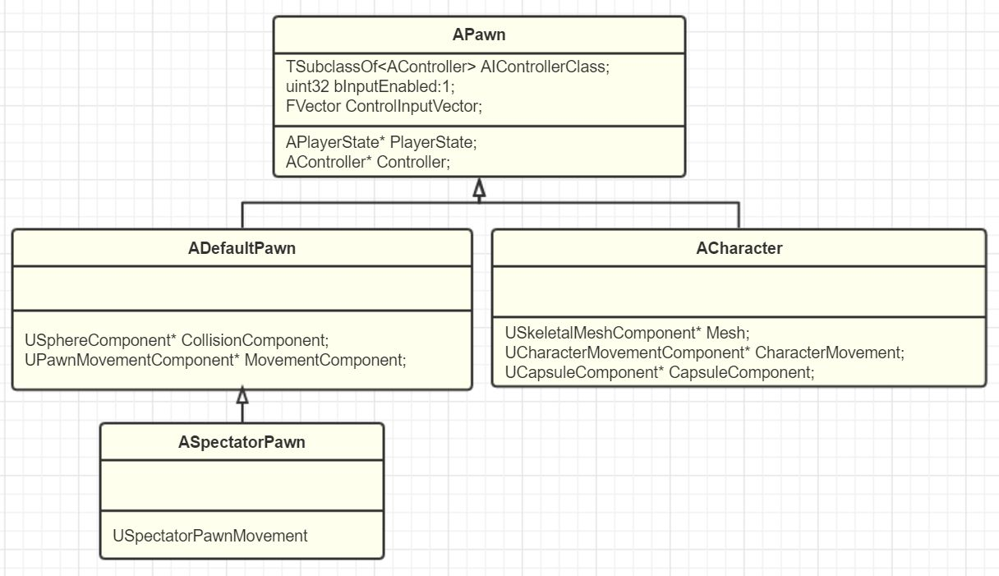
DefaultPawn默认带了一个DefaultPawnMovementComponent spherical CollisionComponent和StaticMeshComponent
### SpectatorPawn
这个是观战得pawn，继承自default pawn，拥有摄像机得漫游能力，拥有USpectatorPawnMovement(该组件是不带重力得漫游)。并关闭了StaticMesh显示，碰撞也设置到了Spectator通道。
### Character
Character是人形得pawn，它有个CharacterMovementComponent，表示玩家得所有移动，游泳，飞翔等等。
CapsuleComponent是一个贴近人形得胶囊。skeletalMesh是有骨骼蒙皮得mesh。并且可以IK。
当你有人形要表示，那就用character，否则就pawn就足够了。
## Controller
Pawn是可以供Controller控制得，而其控制逻辑就是放在Controller里，即业务逻辑是放在controller里得，如玩家按A键，角色自动找一个最近得敌人并攻击。这个寻找目标并攻击得逻辑过程，就是控制pawn得过程。
在游戏中，程序=数据+逻辑+显示
显示就是UI 如屏幕上得3D画面 手柄上得输入震动，VR头盔等等
数据就是Actor Mesh，Matieral，level等等
逻辑就是各种渲染算法，物理模拟，AI寻路等等。
在ue中，逻辑可以说就是我们得controller。
### AController
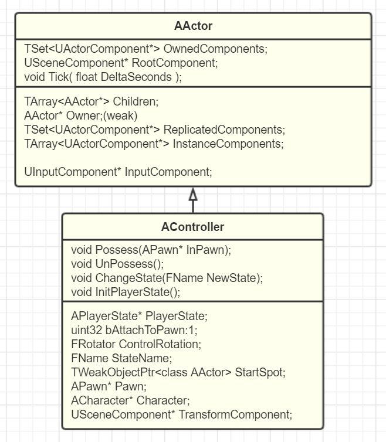
AController继承自Actor，并添加了控制Pawn得接口。Possess和UnPossess，因为继承自Actor，所以有SceneComponent作为rootcomponent，可以放置在世界中。
在UE中，pawn和controller是一对一得关系。如开车时，则需要从人物得controller切换到车辆得控制。
因为是1对1得关系，所以从pawn中提供了GetController方法，同理在controller中提供了GetPawn方法。
Controller本身有位置信息，所以可以利用该信息更好得控制pawn得位置和移动。
Controller的Rotation，因为想要让我的pawn和controller保持旋转朝向一致，因为controller作为控制pawn，所以controller需要维护自己的rotation。
再说位置，为了让pawn在respawn的时候，可以选择当前位置创建，所以controller就有了自己的位置。因此，为了自动更新controller的位置，ue提供了bAttachToPawn的开关选项，默认是关闭的，即默认不会自动更新controller的位置。如果打开，那么controller就会附加到pawn的子节点上，从而更新位置和转向。
当然，如果controller确实只是逻辑控制，如AIController的话，那位置确实不需要更新。
在上面的图中，可以看到，pawn也是能接收到玩家输入的，同时controller也是可以的，并且controller算是第一个接收到输入的。
从概念上，pawn是能动的物体，重点在于动。controller则是动到哪里，重点的是决策，如方向等等。所以，pawn本身固有的能力逻辑，如前进后退，播放动画，碰撞检测之类的，应该放在pawn内实现，而对于一些可替换的逻辑，或者只能决策的，应该放在controller实现。
从对应上来说，如果某个逻辑只属于某类pawn，那可以在pawn内实现(如坦克开炮)，而如果在多个pawn中，如自动寻找攻击目标(如战车和坦克)，那么应该放在controller中。
从存在周期来讲，pawn销毁了就没了，而controller是一直存在的，所以一些逻辑和状态要放在controller里。
### APlayerState
上面说到一些状态可以放在controller里，但是ue实现了APlayerState这个类，来存放玩家状态。controller只作为逻辑的实现。APlayerState继承自AInfo，而AInfo继承自AACtor，因为PlayerState也需要进行网络复制的功能，所以就继承了AInfo。
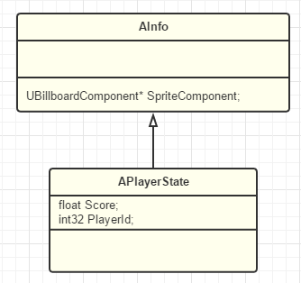
AInfo是不爱表现，纯数据的大本营，继承自Actor，有网络复制等功能。
controller和网络的结合很紧密。可以理解成controller也可以当作玩家在服务器上的代理对象，当玩家偶尔掉线的时候，因为连接不在，所以controller失效被释放了，服务器可以把对应的该PlayerState暂存起来，等玩家再重连上的时候，可以利用该PlayerState重新挂载上controller。有一个顺畅的体验。AIcontroller运行再server上，client上并没有。
应当注意的是，当关卡切换的时候，APlayerState也会被释放掉。所以跨关卡数据不应该放进来。playerstate只表示玩家的游玩数据。而关卡数据应该放在GameState中。
Component->Actor->Pawn->Controller的结构。
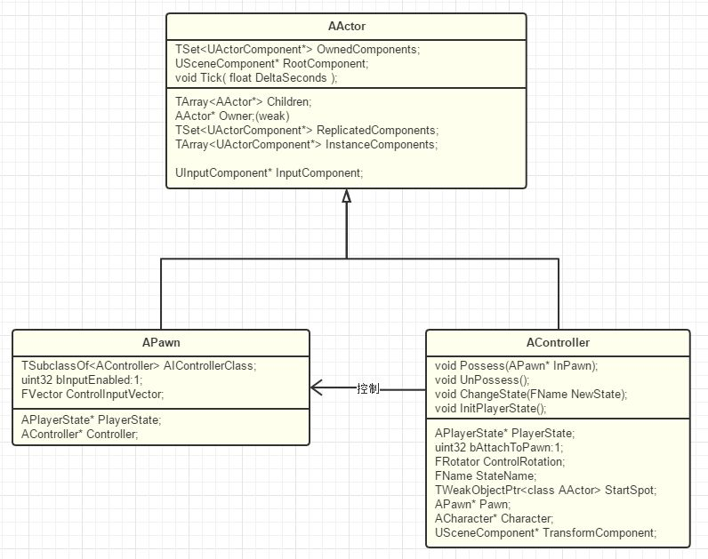
### APlayerController
playercontroller拥有camera和位置，其次可以响应输入(如玩家按下AWSD)。操控pawn(possess后再传递Input)。playercontroller有自己的viewport。
网络上的pawn，实际上是通过server上的playercontroller控制server上的pawn，然后再复制到远程机器上的pawn实现的。
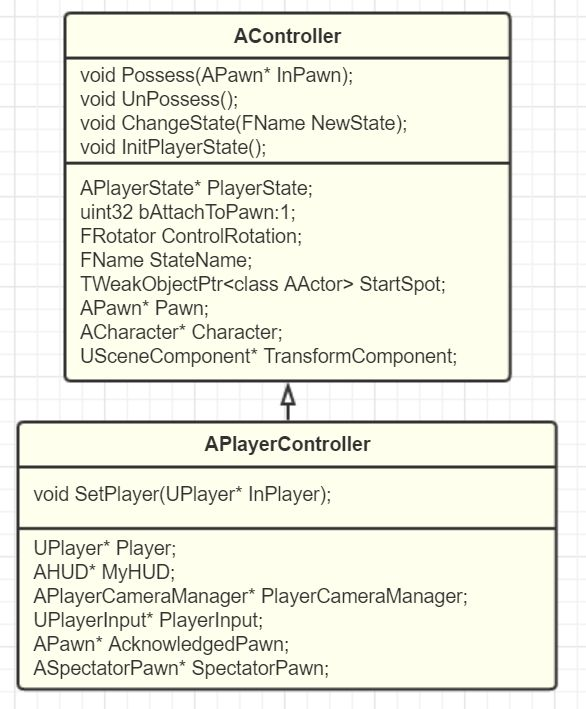
拥有的模块：
1：camera的管理，目的是为了控制玩家的视角，所以有了PlayerCameraManager这一个摄像机管理类。用来方便的切换摄像机。playercontroller的controlrotation和view target也都是为了更新camera的位置。
2：Input系统，自己对输入的处理，使用了UPlayerInput来委托处理。
3：UPlayer关联，playercontroller只有在设置SetPlayer后，才可以正常工作，UPlayer即可以是本地的LocalPlayer，也可以是网络控制UNetConnection。
4：HUD显示，用于在当前控制的摄像机面前显示一些UI。
5：Level的切换，PlayerController作为网络里通道，在一起进行Level Travelling的时候，也都是先通过playercontroller进行rpc调用，然后由playercontroller来转发到自己world中来进行
6：voice，方便网络语音聊天的一些控制函数。
在联机游戏中，只有playerstate会被同步过来，playercontroller只会存在server上。
在任意时刻，UPlayer->PlayerController->PlayerState都是1：1：1的存在。但是可以切换。UPlayer可以理解为一个全局的玩家逻辑实体，playercontroller是玩家的意志，playerstate就是玩家的状态。
### AAIPlayerController
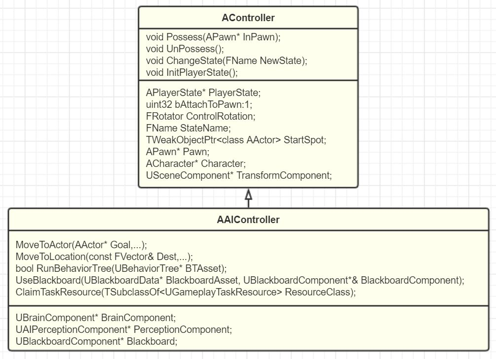
同playercontroller对比，少了camera，input，uplayer关联，hud，voice，level切换接口。
但是多了AI需要的组件。
navigation，智能导航寻路。在移动的过程中，因为少了玩家控制来转向，所以增加了SetFocus来控制当前的pawn视角朝向位置。
AI组件，运行启动行为树，使用黑板数据，探索周围环境。
task系统，让ai去完成一些任务。GamePlayAbilities为actor添加额外能力属性的模块，如hp，mp，GamePlayEffect则是加buff的。
同playercontroller上，aicontroller也只存在于server上。
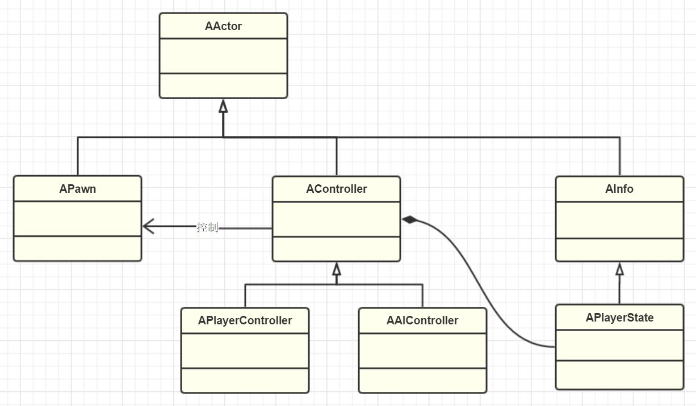
## GameMode
简单的来说，world由一个persistentlevel和一些sublevels组成，persistentlevel切换了，相应的world也会切换。
一个world就是一个game，其玩法叫做mode，
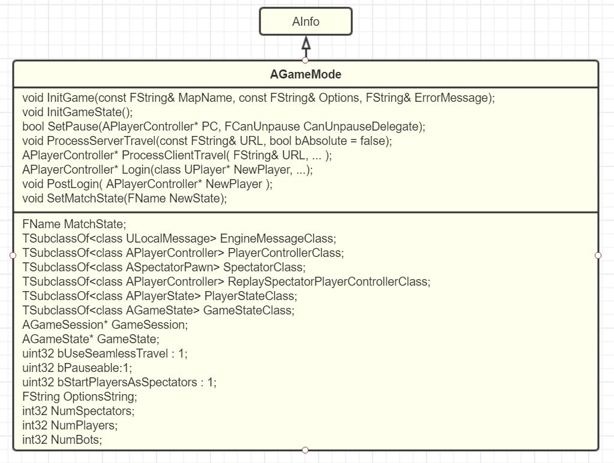
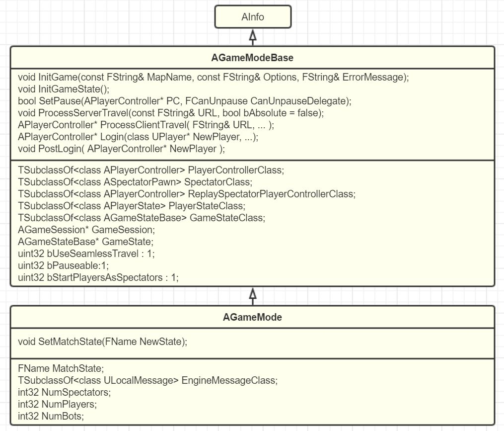
1：gamemode记录了class
如下，注册这些class
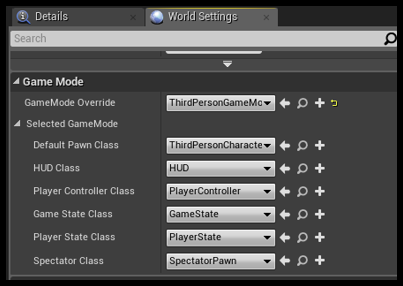
2：游戏的进度，如支不支持暂停，怎么重启等游戏内的状态操作，SetPause RestartPlayer等函数控制
3：Level的切换，或者说world的切换更为合适，gamemode决定了刚进入一场游戏是否需要播放开场动画(cinematic)，也决定了切换到下一个关卡是否要bUseSeamlessTracel，一旦开启这个选项后，你可以重载GameMode和PlayerController的GetSeamlessTravelActorList和GetSeamlessTravelActorList来指定哪些actors不被释放而进入下一个World的level。
4：多人游戏的步调同步，在多人游戏中，常常需要等待所有玩家都连上后，载入地图完毕才能一起开始逻辑，因此UE提供了MatchState来指定一场游戏运行的状态。
gamemode在一个world中，只会是president配置的那个gamemodeclass。
当进行travelling进入新的world的时候，如果没开启bUseSeamlessTravel的时候，那么当前的gamemode将会被释放，并且创建travel后的world的gamemode。当开启时，当前的world的gamemode会调用GetSeamlessTravelActorList。可以看到这个函数，默认会add this，把这个gamemode保留下来。

	void AGameMode::GetSeamlessTravelActorList(bool bToTransition, TArray<AActor*>& ActorList)
	{
		UWorld* World = GetWorld();
		// Get allocations for the elements we're going to add handled in one go
		const int32 ActorsToAddCount = World->GameState->PlayerArray.Num() + (bToTransition ?  3 : 0);
		ActorList.Reserve(ActorsToAddCount);

		// always keep PlayerStates, so that after we restart we can keep players on the same team, etc
		ActorList.Append(World->GameState->PlayerArray);

		if (bToTransition)
		{
			// keep ourselves until we transition to the final destination
			ActorList.Add(this);
			// keep general game state until we transition to the final destination
			ActorList.Add(World->GameState);
			// keep the game session state until we transition to the final destination
			ActorList.Add(GameSession);

			// If adding in this section best to increase the literal above for the ActorsToAddCount
		}
	}
当从transitionworld迁移到newworld的时候，bToTransition为false，所以在newworld后，也会重新创建gamemode。
结论是，ue的travelling，会使用一个中间world作为过渡，gamemode在新的world里是会新生成一个的，即使class类型一致，即使bUseSeamlessTravel，因此在travelling时，要小心再GameMode里的状态丢失，不过pawn和controller默认时一致的。
level和gamemode
从概念上讲，level是表示，而gamemode是逻辑，level管理的是自身的逻辑，而gamemode在level和sublevel间一直存在，所以gamemode专注于玩法，如胜利条件，刷怪条件等等。level管理自身actor，如某块区域有重力等等。
gamemode只在server中存在，client只负责展示，但是client有level scriptor
gamemode专注于游戏玩法本身，而player controller则专注于玩家本身。
gameinstance关注不同的world，而gamemode只关注自身的world。
## GameState
上面说到PlayerState是玩家的状态，而游戏的状态则是由gamestate保存在server上的。
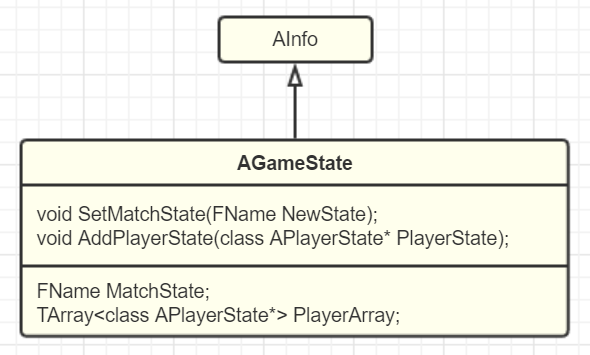
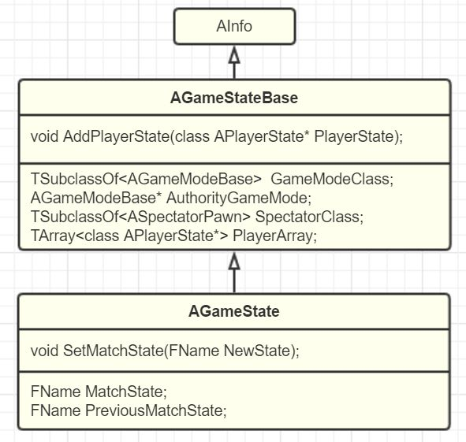
gamestate在client和server上都存在。同时它保存了APlayerState。它收集了server上的playerstate，所以在client中，就可以看到别的client的state了。gamemode纯在server上有，所以client上看不到。
## GameSession
是在网络联机游戏中，针对session使用的一个管理类。
协调场景的表现通过level scriptor，而玩法则是通过gamemode。
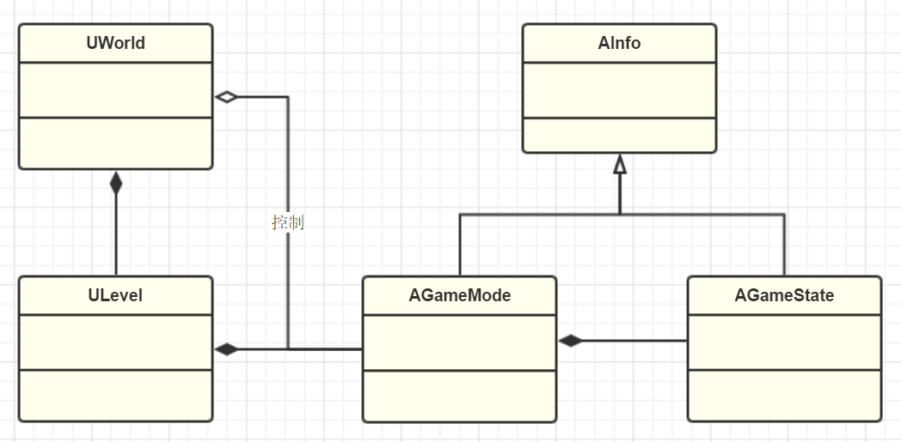
## UPlayer
在ue中，Player指的是输入的一个抽象。比如本地输入和远端网络输入，都是player。所以它并不是一个actor，不需要摆放在场景中，因此它是直接继承自UObject。
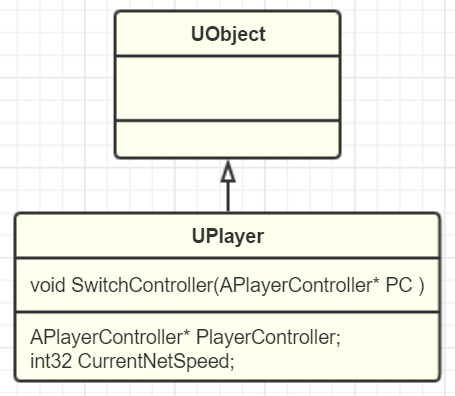
可以看到，player怎么在游戏中表现呢，因为有输入就是一个player，因此为了在游戏中表现出来，它是需要和playercontroller关联起来。这样player的输入，就能在场景中表现出来。
### ULocalPlayer
ULocalPlayer表示本地输入，比如手柄啊，那些，在本地设备输入的，就看作一个localplayer。
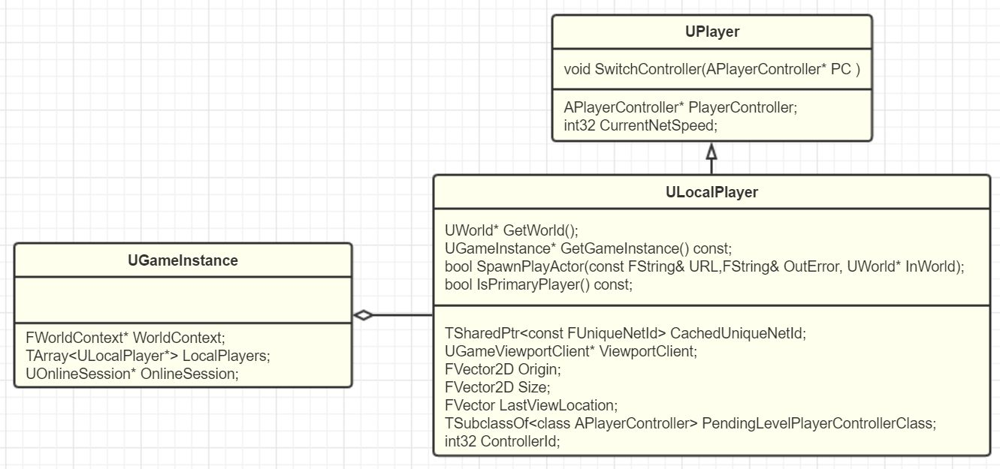
可以看到，在gameinstance保存这localplayer的指针，同时相比player，localplayer多了viewport的相关配置。gameinstance有localplayer后，可以方便的实现跟本地玩家相关的操作。

