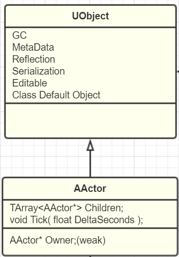
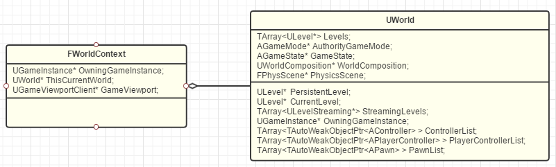

# InsideUE文章的记录
https://www.zhihu.com/column/insideue4
## UObject
在UE4中，几乎所有的类都继承自UObject，UObject为他们提供了基础的垃圾回收，反射，元数据，序列化等等。

## Actor
Actor继承自UObject，能在场景中放置的都是Actor，同时它也多了额外的属性，如Replication(网络复制) Spwan(生成) Tick(每帧执行的函数)
一个对象在3D世界中表示，必需要有Transform合Matrix。但是有些对象它是Actor，但是不需要表示其位置，如Ainfo(AWorldSetting AGameMode AGameSession APlayerState AGameState) AHUD APlayerCameraManager等，他们代表了世界的某种信息，状态，规则。但是他们不需要在场景中显示出来。
在UE中，万物皆是Actor。

UE把Transform封装进了SceneComponent，要显示位置的Actor，就有这个RootComponent，即物体加组件的模式。
所以Actor获取位置或者设置位置，都是dispatch到这个RootComponent的。
同理，要获取输入的话，就需要InputComponent。
UE也是参考了Unity的，采用了这种ECS架构，Actor只是个基础，而功能都是由component实现的。

	TSet<UActorComponent*> OwnedComponents，保存着这个Actor所拥有的所有components。一般会有一个SceneComponent作为其RootComponent。
	TArray<UActorComponent*> InstanceComponents 保存着其实例化的components，一个Actor如果想放进Level里，就必须实例化USceneComponent* RootComponent
### ActorComponent
components的类图如下。

可以看到，SceneComponent有Transform，另外的AttachParent和AttachChildren告诉我们，component可以作为另一个component的父类，即components可以嵌套。
一个component可以有多个component子类。但是注意限制，只有SceneComponent才可以互相嵌套。而最上层的ActorComponent是不行的。
可以说，只有位置Transform的component才能互相嵌套。

但是也要注意SceneComponent嵌套过深的问题。
### Actor之间的父子关系
Actor之间的父子关系是通过Component确定的，UE里通过Child:AttachToActor或Child:AttachToComponent来创建父子连接的。

	void AActor::AttachToActor(AActor* ParentActor, const FAttachmentTransformRules& AttachmentRules, FName SocketName)
	{
		if (RootComponent && ParentActor)
		{
			USceneComponent* ParentDefaultAttachComponent = ParentActor->GetDefaultAttachComponent();
			if (ParentDefaultAttachComponent)
			{
				RootComponent->AttachToComponent(ParentDefaultAttachComponent, AttachmentRules, SocketName);
			}
		}
	}
	void AActor::AttachToComponent(USceneComponent* Parent, const FAttachmentTransformRules& AttachmentRules, FName SocketName)
	{
		if (RootComponent && Parent)
		{
			RootComponent->AttachToComponent(Parent, AttachmentRules, SocketName);
		}
	}
可以看到，它实际上是拿自身的RootComponent附加Attach到父节点的RootComponent上或者某个component上的。所以本质上来讲，还是SceneComponent的互相嵌套。
可以绑定到不同的component上，意味着就是有多个不同的锚点。比如mesh上的武器socket槽。那么运动的时候，父节点component的Transform就会影响到子component上。
Actor其实更像一个容器，只提供基本的创建销毁，网络复制，事件触发等一些逻辑性的功能，而父子的关系维护就委托给了具体的SceneComponent。
### ChildActorComponent
ChildActorComponent担负着Actor之间互相组合的胶水。它的ChildActorClass表示它实例化时要创建的Actor。
## Level
一个Level组织所有的Actor，多个Level组成World。

AInfo，记录着本Level的各种规则属性。WorldSettings记录Level的规则。
## World
当一个World有多个level的时候，这些Level在什么位置，是在一开始加载进来的，还是Streaming运行时加载，每个World支持一个PersistentLevel和多个其它level。
Persistent即一开始加载进world，streaming时后续动态加载的意思，levels里保存有所有的当前已经加载的level，streaminglevels保存整个world的levels配置列表。

玩家切换场景，就是在world种加载和释放不同的Level。
## WorldContext
World可以有多个，主要是编辑器一个world，编辑器里的game一个world，worldcontext负责这些world的切换，而同时也保存着Level切换的上下文。TravelUrl和TravelType就是负责设定下一个level的目标和转换过程。
level的上下文由worldcontext来保存，而不是由world。world和level的切换是在下一帧完成的。

## GameInstance
GameInstance管理着当前worldcontext和其它对象，它在游戏的运行中一直存在，所以那些独立于level的逻辑或数据，可以放在gameinstance里。

## Engine
它保存着所有的WorldContext，编辑器也是一个WorldContext，其实编辑器也是一个游戏，我们在游戏中开发游戏。

## GamePlayStatics
这个类是暴露给蓝图用的静态类，是一个蓝图函数库，如GetPlayerController, SpawnActor等等方法，其实它就是封装了操作world和level的能力。
Object->Actor+Component->Level->World->WorldContext->GameInstance->Engine
## Pawn
Actor可以说是由component组成的，即Actor的功能实现是由component实现的，在UE里，component表达的是功能的概念。你的component是可以随便迁移到下一个游戏中的，actor没有你的component也是可以运行的。
当你发现违背了这两点，那么你的component就是失败的。耦合度太高了，你应该重新设计。blueprintActor其实就是unity中的预制体prefab。
Pawn可以被controller控制，有3块基本的接口
1：可被controller控制 可以响应输入
2：PhysicsCollision表示 表达自身的存在，物理表示
3：MovementInput的基本接口 可以移动。

pawn想表达的最关键的点是它可以被controller操纵的能力，这是它与普通actor的区别。
输入事件处理流程：

从上面的图可以看出，响应输入的首先是actor检测是否可以接收输入，接着是PlayerController，接着是Level BluePrint，最后才是Pawn。
输入的处理功能被实现为InputComponent，输入的种类就很多了，按键 摇杆 触摸等等。
响应了按键之后，响应逻辑是在MovementInput里处理的。

